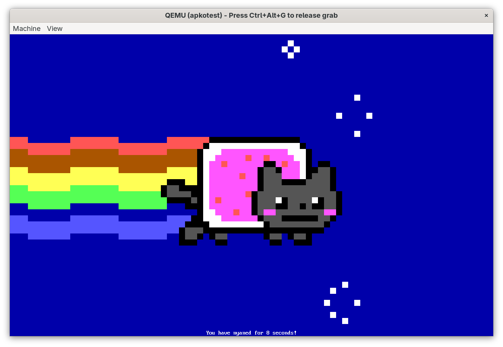

# apko-uki-template

Simple bootable Alpine Linux UKI composed with my `apko` fork that supports lockfiles.

Has a sample workload (see image) and just enough scaffolding to actually work, but nothing else.



## Usage

This project is built with the assumption that Nix is available. I've tested it only on NixOS but Nix installed on other distributions may also work.

Enter Nix development shell:
```sh
nix develop
```

Build config overlay package using the contents of `/config`:
```sh
just config
```

Populate lockfile (`apko.lock`):
```sh
just lock
```

Build image with lockfile as an input:
```sh
just image
```

Test in QEMU (full UEFI VM using UKI):
```sh
just qemu
```

Test in QEMU (microVM):
```sh
just microvm
```
